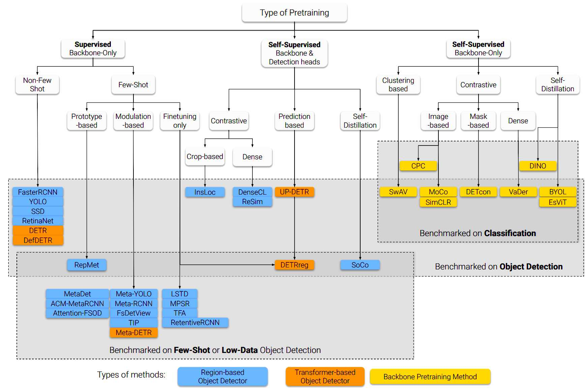

# Awesome Few-Shot Object Detection

Leaderboard, taxonomy, and curated list of few-shot object detection papers.

Maintainers: [Gabriel Huang](https://gabrielhuang.github.io)

<a href="https://arxiv.org/abs/2110.14711"></img></a>

Please check out our [survey on few-shot and self-supervised object detection](https://arxiv.org/abs/2110.14711) for an introduction to these topics.

## Contributing
If you want to add your paper or report a mistake, please create a pull request with all supporting information. Thanks!

## Papers

## Pascal VOC and MS COCO Leaderboard

In this table we distinguish [Kang's Splits](https://arxiv.org/pdf/1812.01866.pdf) (Meta-YOLO) from [TFA's splits](https://arxiv.org/pdf/2003.06957.pdf) (Frustratingly Simple FSOD), as the Kang splits have been [shown](https://arxiv.org/pdf/2003.06957.pdf) to have high variance and overestimate performance for low number of shots (see for yourself -- check the difference between TFA 1-shot and Kang 1-shot in the table below).

|Name|Type|VOC TFA 1-shot (mAP50)|VOC TFA 3-shot (mAP50)|VOC TFA 10-shot (mAP50)|VOC Kang 1-shot (mAP50)|VOC Kang 3-shot (mAP50)|VOC Kang 10-shot (mAP50)|MS COCO 10-shot (mAP)|MS COCO 30-shot (mAP)|
|---|---|---|---|---|---|---|---|---|---|
|[LSTD](https://arxiv.org/pdf/1803.01529.pdf)|finetuning|-|-|-|8.2|12.4|38.5|-|-|
|[RepMet](https://arxiv.org/pdf/1806.04728.pdf )|prototype|-|-|-|26.1|34.4|41.3|-|-|
|[Meta-YOLO](https://arxiv.org/pdf/1812.01866.pdf)|modulation|14.2|29.8|-|14.8|26.7|47.2|5.6|9.1|
|[MetaDet](https://openaccess.thecvf.com/content_ICCV_2019/papers/Wang_Meta-Learning_to_Detect_Rare_Objects_ICCV_2019_paper.pdf)|modulation|-|-|-|18.9|30.2|49.6|7.1|11.3|
|[Meta-RCNN](https://arxiv.org/pdf/1909.13032.pdf)|modulation|-|-|-|19.9|35.0|51.5|8.7|12.4|
|[Faster RCNN+FT](https://arxiv.org/pdf/2003.06957.pdf)|finetuning|9.9|21.6|35.6|15.2|29.0|45.5|9.2|12.5|
|[ACM-MetaRCNN](http://xiongweiwu.github.io/papers/MM2020_meta.pdf)|modulation|-|-|-|31.9|35.9|53.1|9.4|12.8|
|[TFA w/fc](arxiv)|finetuning|22.9|-|-|-|-|-|-|-|
|[method](arxiv)|finetuning|-|-|-|-|-|-|-|-|
|[method](arxiv)|finetuning|-|-|-|-|-|-|-|-|
|[method](arxiv)|finetuning|-|-|-|-|-|-|-|-|
|[method](arxiv)|finetuning|-|-|-|-|-|-|-|-|
|[method](arxiv)|finetuning|-|-|-|-|-|-|-|-|
