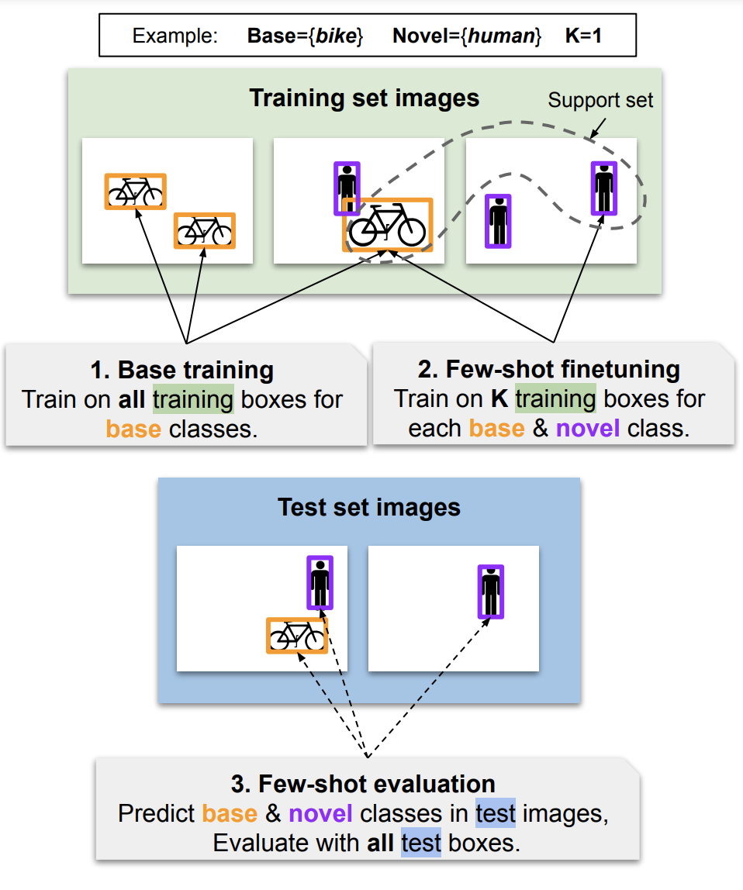

# Awesome Few-Shot Object Detection (FSOD)

Leaderboard, taxonomy, and curated list of few-shot object detection papers.

Maintainers: [Gabriel Huang](https://gabrielhuang.github.io)

<a href="https://arxiv.org/abs/2110.14711"></img></a>

For an introduction to the few-shot object detection framework <a href="#introduction-few-shot-object-detection">read below</a>, or check our our [survey on few-shot and self-supervised object detection](https://arxiv.org/abs/2110.14711) and its [project page](https://gabrielhuang.github.io/fsod-survey/) for full explanations, discussions on the pitfalls of the Pascal, COCO, and LVIS benchmarks used below, main takeaways and future research directions.

## Contributing
If you want to add your paper or report a mistake, please create a pull request with all supporting information. Thanks!

## Pascal VOC and MS COCO FSOD Leaderboard

In this table we distinguish [Kang's Splits](https://arxiv.org/pdf/1812.01866.pdf) (Meta-YOLO) from [TFA's splits](https://arxiv.org/pdf/2003.06957.pdf) (Frustratingly Simple FSOD), as the Kang splits have been [shown](https://arxiv.org/pdf/2003.06957.pdf) to have high variance and overestimate performance for low number of shots (see for yourself -- check the difference between TFA 1-shot and Kang 1-shot in the table below).

|Name|Type|VOC TFA 1-shot (mAP50)|VOC TFA 3-shot (mAP50)|VOC TFA 10-shot (mAP50)|VOC Kang 1-shot (mAP50)|VOC Kang 3-shot (mAP50)|VOC Kang 10-shot (mAP50)|MS COCO 10-shot (mAP)|MS COCO 30-shot (mAP)|
|---|---|---|---|---|---|---|---|---|---|
|[LSTD](https://arxiv.org/pdf/1803.01529.pdf)|finetuning|-|-|-|8.2|12.4|38.5|-|-|
|[RepMet](https://arxiv.org/pdf/1806.04728.pdf )|prototype|-|-|-|26.1|34.4|41.3|-|-|
|[Meta-YOLO](https://arxiv.org/pdf/1812.01866.pdf)|modulation|14.2|29.8|-|14.8|26.7|47.2|5.6|9.1|
|[MetaDet](https://openaccess.thecvf.com/content_ICCV_2019/papers/Wang_Meta-Learning_to_Detect_Rare_Objects_ICCV_2019_paper.pdf)|modulation|-|-|-|18.9|30.2|49.6|7.1|11.3|
|[Meta-RCNN](https://arxiv.org/pdf/1909.13032.pdf)|modulation|-|-|-|19.9|35.0|51.5|8.7|12.4|
|[Faster RCNN+FT](https://arxiv.org/pdf/2003.06957.pdf)|finetuning|9.9|21.6|35.6|15.2|29.0|45.5|9.2|12.5|
|[ACM-MetaRCNN](http://xiongweiwu.github.io/papers/MM2020_meta.pdf)|modulation|-|-|-|31.9|35.9|53.1|9.4|12.8|
|[TFA w/fc](https://arxiv.org/pdf/2003.06957.pdf)|finetuning|22.9|40.4|52.0|36.8|43.6|57.0|10.0|13.4|
|[TFA w/cos](https://arxiv.org/pdf/2003.06957.pdf)|finetuning|25.3|42.1|52.8|39.8|44.7|56.0|10.0|13.7|
|[Retentive RCNN](https://openaccess.thecvf.com/content/CVPR2021/papers/Fan_Generalized_Few-Shot_Object_Detection_Without_Forgetting_CVPR_2021_paper.pdf)|finetuning|-|-|-|42.0|46.0|56.0|10.5|13.8|
|[MPSR](https://arxiv.org/pdf/2007.09384.pdf)|finetuning|-|-|-|41.7|51.4|61.8|9.8|14.1|
|[Attention-FSOD](https://arxiv.org/pdf/1908.01998.pdf)|modulation|-|-|-|-|-|-|12.0|-|
|[FsDetView](https://arxiv.org/pdf/2007.12107.pdf)|finetuning|24.2|42.2|57.4|-|-|-|12.5|14.7|
|[CME](https://arxiv.org/abs/2103.04612)|finetuning|-|-|-|41.5|50.4|60.9|15.1|16.9|
|[TIP](https://openaccess.thecvf.com/content/CVPR2021/papers/Li_Transformation_Invariant_Few-Shot_Object_Detection_CVPR_2021_paper.pdf)|add-on|27.7|43.3|59.6|-|-|-|16.3|18.3|
|[DAnA](https://arxiv.org/abs/2102.12152)|modulation|-|-|-|-|-|-|18.6|21.6|
|[DeFRCN](https://arxiv.org/abs/2108.09017)|prototype|-|-|-|53.6|61.5|60.8|18.5|22.6|
|[Meta-DETR](https://arxiv.org/pdf/2103.11731.pdf)|modulation|20.4|46.6|57.8|-|-|-|17.8|22.9|
|[DETReg](https://arxiv.org/pdf/2106.04550.pdf)|finetuning|-|-|-|-|-|-|18.0|30.0|

## FSOD Framework

Here we explain the few-shot object detection framework as defined by the [Meta-YOLO](https://arxiv.org/pdf/1812.01866.pdf) paper (Kang's splits). Full details can be found [here](https://arxiv.org/abs/2110.14711).

FSOD partitions objects into two disjoint sets of categories: *base* or known/source classes, which are object categories for which we have access to a large number of training examples; and *novel* or unseen/target classes, for which we have only a few training examples (shots) per class. The FSOD task is formalized into the following steps:
- **1. Base training**.&sup1; Annotations are given only for the base classes, with a large number of training examples per class (*bikes* in the example). We train the FSOD method on the base classes.
- **2. Few-shot finetuning.** Annotations are given for the *support set*, a very small number of training examples from both the base and novel classes (one *bike* and one *human* in the example). Most methods finetune the FSOD model on the support set, but some methods might only use the support set for conditioning during evaluation (finetuning-free methods).
- **3. Few-shot evaluation.** We evaluate the FSOD to jointly detect base and novel classes from the test set (few-shot refers to the size of the support set). The performance metrics are reported separately for base and novel classes. Common evaluation metrics are variants of the mean average precision: mAP50 for Pascal and COCO-style mAP for COCO. They are often denoted bAP50, bAP75, bAP (resp. nAP50, nAP75, nAP) for the base and novel classes respectively, where the number is the IoU-threshold in percentage.

</img>

In pure FSOD, methods are usually compared solely on the basis of novel class performance, whereas in Generalized FSOD, methods are compared on both base and novel class performances [[2](https://openaccess.thecvf.com/content/CVPR2021/papers/Fan_Generalized_Few-Shot_Object_Detection_Without_Forgetting_CVPR_2021_paper.pdf)]. Note that "training" and "test" set refer to the splits used in traditional object detection. Base and novel classes are typically present in both the training and testing sets; however, the novel class annotations are filtered out from the training set during base training; during few-shot finetuning, the support set is typically taken to be a (fixed) subset of the training set; during few-shot evaluation, all of the test set is used to reduce uncertainty [[1](https://arxiv.org/pdf/1812.01866.pdf)].

For conditioning-based methods with no finetuning, few-shot finetuning and few-shot evaluation are merged into a single step; the novel examples are used as support examples to condition the model, and predictions are made directly on the test set. In practice, the majority of conditioning-based methods reviewed in this survey do benefit from some form of finetuning.

*&sup1;In the context of self-supervised learning, base-training may also be referred to as *finetuning* or *training*. This should not be confused with *base training* in the meta-learning framework; rather this is similar to the meta-training phase [[3](https://arxiv.org/abs/1703.03400)].
